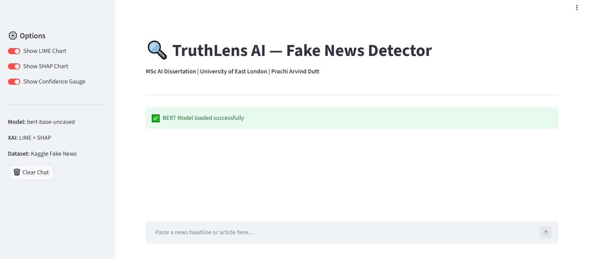
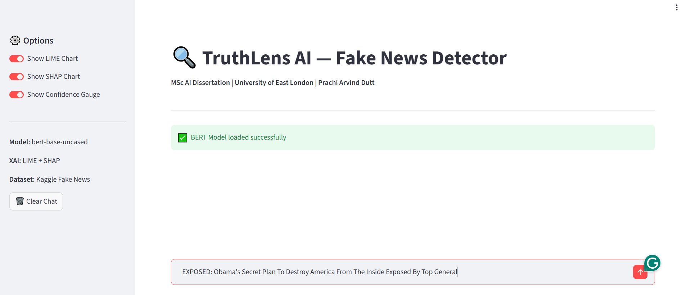
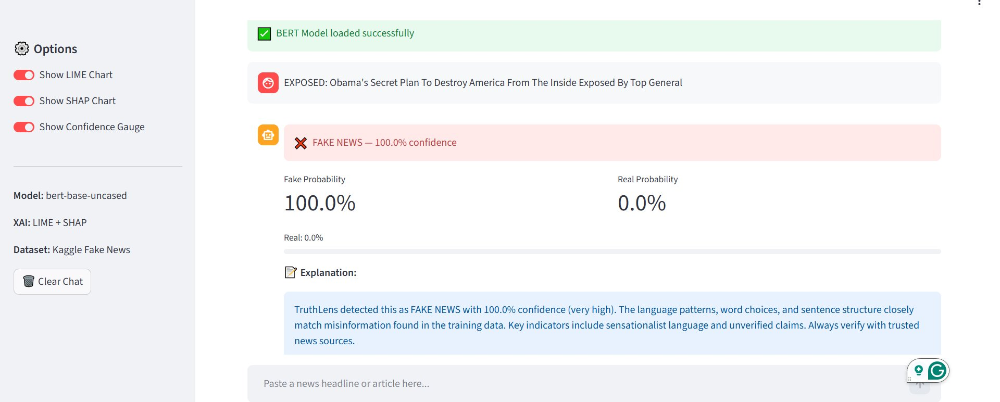
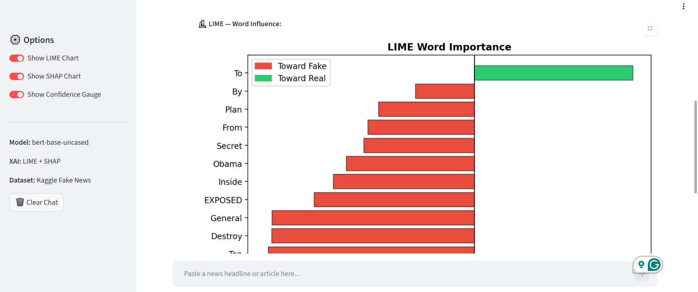
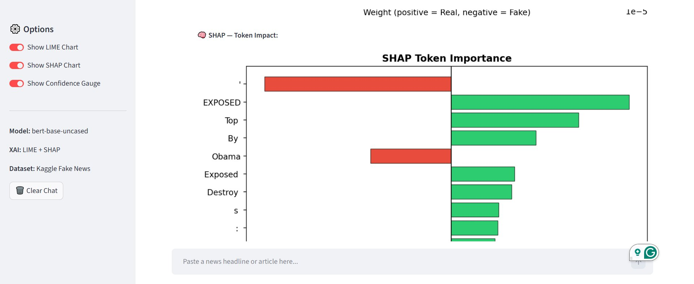
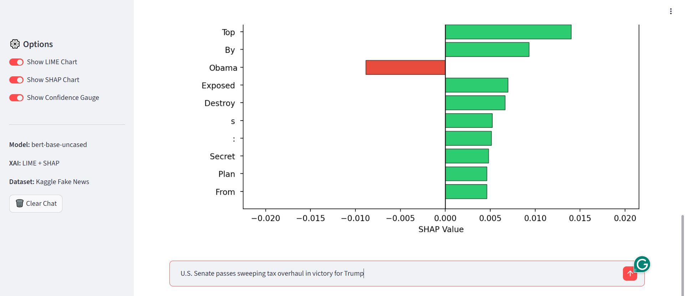
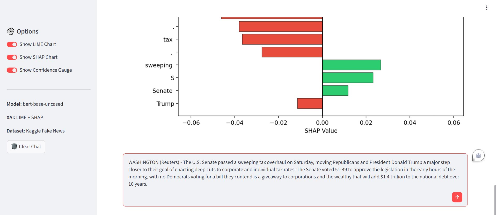
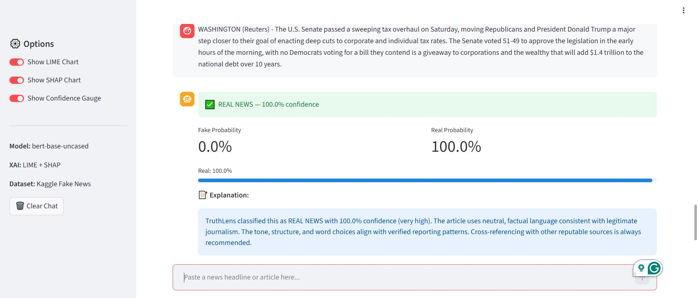
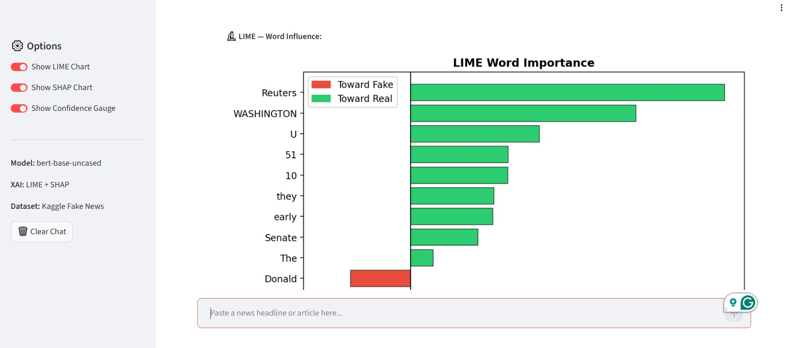
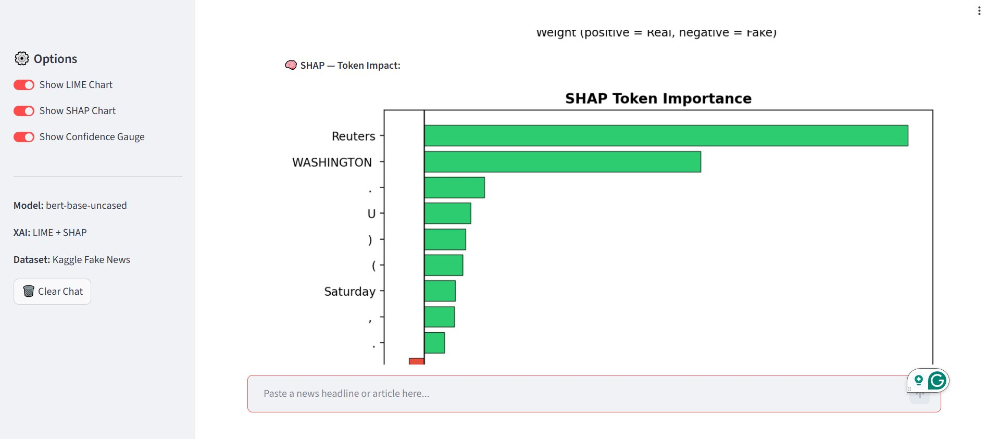

# 🔍 TruthLens AI — Explainable Fake News Detection Using Transformer-Based NLP Models

> **MSc Artificial Intelligence Dissertation (CN7000)**  
> University of East London | Prachi Arvind Dutt

---

## 📌 Overview

TruthLens AI is a web-based fake news detection application that combines the power of a fine-tuned BERT model with explainable AI (XAI) techniques. Users can paste any news article and receive a real-time prediction (**Real** or **Fake**) along with transparent, human-readable explanations of *why* the model made that decision — powered by LIME and SHAP.

---

## ✨ Key Features

- 🤖 **BERT-based Classification** — Fine-tuned `bert-base-uncased` achieving **99.94% accuracy**
- 🔬 **Explainability with LIME & SHAP** — Visual word-level explanations showing which words influenced the prediction
- 🌐 **Interactive Streamlit App** — Chat-style interface for real-time predictions
- 📊 **Confidence Gauge** — Shows Fake/Real probability percentages
- 📈 **Baseline Comparison** — TF-IDF + Logistic Regression baseline (98.76%) included for benchmarking

---

## 🖥️ App Screenshots

### Home Page
The main interface with sidebar options for LIME Chart, SHAP Chart, and Confidence Gauge toggles.

<p align="center">
  
</p>

---

### Fake News Detection

**Input:** A fake news headline is entered into the app.

<p align="center">
  
</p>

**Result:** The model detects it as **FAKE NEWS with 100% confidence**, with a detailed explanation.

<p align="center">
  
</p>

**LIME Explanation:** Shows which words pushed the prediction toward Fake (red) or Real (green). Words like "EXPOSED", "Destroy", "Secret" strongly indicate fake news.

<p align="center">
  
</p>

**SHAP Explanation:** Token-level SHAP values showing the contribution of each word to the prediction.

<p align="center">
  
</p>

<p align="center">
  
</p>

---

### Real News Detection

**Input:** A real Reuters news article is entered into the app.

<p align="center">
  
</p>

**Result:** The model classifies it as **REAL NEWS with 100% confidence**, with explanation noting neutral, factual language.

<p align="center">
  
</p>

**LIME Explanation:** Words like "Reuters", "WASHINGTON", "Senate" strongly indicate real news (green bars).

<p align="center">
  
</p>

**SHAP Explanation:** Token-level analysis confirms "Reuters" and "WASHINGTON" as the strongest real-news indicators.

<p align="center">
  
</p>

---

## 📂 Dataset

- **Source:** [Kaggle — Fake and Real News Dataset](https://www.kaggle.com/datasets/clmentbisaillon/fake-and-real-news-dataset) by Clément Bisaillon
- **Size:** ~44,900 articles (balanced: ~21,400 real + ~23,500 fake)
- **Preprocessing:** Title + text combined, lemmatization applied, subject/date columns dropped to prevent data leakage

---

## 🧠 Model Details

| Component | Detail |
|---|---|
| Model | `bert-base-uncased` (Devlin et al., 2019) |
| Optimizer | AdamW |
| Learning Rate | 2e-5 |
| Batch Size | 16 |
| Epochs | 3 |
| Accuracy | **99.94%** |
| Baseline (TF-IDF + LR) | 98.76% |

---

## 🛠️ Tech Stack

- **Python** — Core language
- **PyTorch & Hugging Face Transformers** — Model training and inference
- **LIME** (Ribeiro et al., 2016) — Local word-level explanations
- **SHAP** (Lundberg & Lee, 2017) — Global and local feature attribution
- **Streamlit** — Web app framework
- **Google Colab** — Training environment
- **ngrok** — Public URL tunnelling for deployment

---

## 🚀 How to Run

1. **Clone the repository**
   ```bash
   git clone https://github.com/YOUR_USERNAME/truthlens-ai.git
   cd truthlens-ai
   ```

2. **Install dependencies**
   ```bash
   pip install -r requirements.txt
   ```

3. **Run the Streamlit app**
   ```bash
   streamlit run app.py
   ```

4. Open the URL shown in your terminal (usually `http://localhost:8501`)

---

## 📁 Project Structure

```
truthlens-ai/
├── app.py                  # Streamlit web application
├── model/                  # Saved fine-tuned BERT model
├── notebooks/              # Jupyter notebooks (training, EDA, evaluation)
├── screenshots/            # App UI screenshots
├── requirements.txt        # Python dependencies
└── README.md               # This file
```

---

## 📚 References

- Devlin, J., Chang, M.W., Lee, K. and Toutanova, K. (2019) 'BERT: Pre-training of Deep Bidirectional Transformers for Language Understanding', *NAACL-HLT*.
- Ribeiro, M.T., Singh, S. and Guestrin, C. (2016) '"Why Should I Trust You?": Explaining the Predictions of Any Classifier', *KDD*.
- Lundberg, S.M. and Lee, S.I. (2017) 'A Unified Approach to Interpreting Model Predictions', *NeurIPS*.

---

## 👩‍💻 Author

**Prachi Arvind Dutt** — MSc Artificial Intelligence, University of East London

---

## 📄 License

This project is submitted as part of an academic dissertation and is intended for educational purposes.
